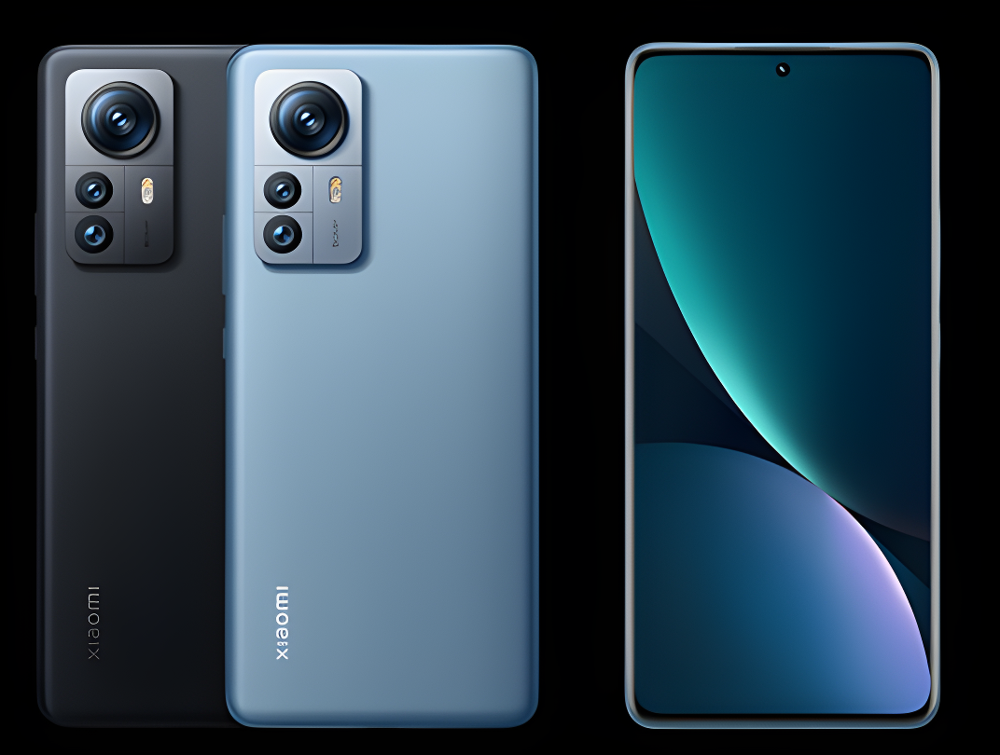

# Device tree for Xiaomi 12 Pro Dimensity Edition (daumier)
The Xiaomi 12 Pro Dimensity Edition (codenamed _"daumier"_) is a flagship smartphone from Xiaomi.

It was announced on 2022, July 04. Release date was 2022, July 13.

## Device specifications

Basic   | Spec Sheet
-------:|:-------------------------
CPU     | 1x3.2 GHz Cortex-X2 & 3x2.85 GHz Cortex-A710 & 4x1.8 GHz Cortex-A510
Chipset | MediaTek Dimensity 9000+ (4 nm)
GPU     | Mali-G710 MC10
Memory  | 8/12 GB RAM
Shipped Android Version | Android 12, MIUI 13
Storage | 128/256/512 GB (UFS 3.1)
Battery | Non-removable Li-Po 5160 mAh battery
Display | 6.73 inches, AMOLED, 1440 x 3200 pixels (2K), 120Hz, Dolby Vision, HDR10+

## Device picture

